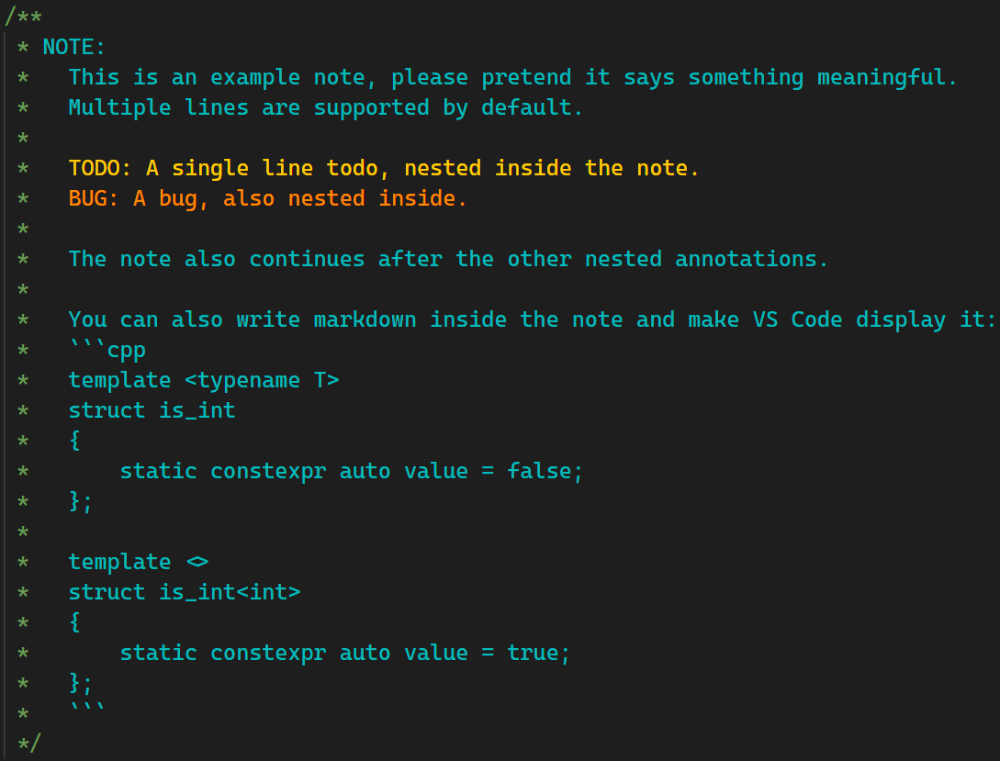

# Visual Studio Code Todo Highlighter

Highlight annotations inside comments. By default, 3 types of annotations are supported: `NOTE`, `TODO` and `BUG`. They can be used by writing e.g. `NOTE:` or `NOTE@Whatever:`.

The can be displayed as markdown within VS Code. This is how the above example looks like:

